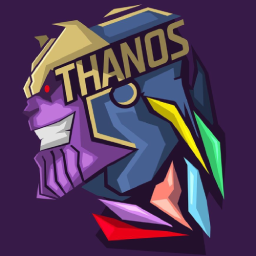

<h1 align="center">
   
  
   
  Thanos theme by <a href="https://github.com/arthur404dev">arthur404dev</a>
   
</h1>

  <strong>A theme made by a Titan to conquer the universe</strong>

  <a href="#colors">Colors</a> 👾
  <a href="#install">Install</a> 👾
  <a href="#contributors">Contributors</a> 👾
  <a href="#license">License</a>

  

## Colors

| Name             | Type | 🎨                                                                       | Hex       | RGB           | HSL                 | CMYK          |
| ----------------- | ---- | ------------------------------------------------------------------------ | --------- | ------------- | ------------------- | ------------- |
| Galaxy            | 🌌   |                        | `#181B28` | `24,27,40`    | `228.8,25%,12.5%`   | `40,33,0,84`  |
| Black-Hole        | 🌌   |                | `#151825` | `21,24,37`    | `228.8,27.6%,11.4%` | `43,35,0,85`  |
| Dwarf-Star        | 🌌   |                | `#B9C3D5` | `185,195,213` | `218.6,25%,78%`     | `13,8,0,16`   |
| Supernova         | 🌌   |                  | `#F8F8F0` | `248,248,240` | `60,36.4%,95.7%`    | `0,0,3,3`     |
| Voice of Universe | 🌌   |  | `#5F6167` | `95,97,103`   | `225,4%,38.8%`      | `8,6,0,60`    |
| Crescent Moon     | 🌌   |          | `#705FBD` | `112,95,189`  | `250.9,41.6%,55.7%` | `41,50,0,26`  |
| Half Moon         | 🌌   |                  | `#4B5783` | `75,87,131`   | `227.1,27.2%,40.4%` | `43,34,0,49`  |
| Shadow Moon       | 🌌   |              | `#2A3049` | `42,48,73`    | `228.4,27%,22.5%`   | `42,34,0,71`  |
| Power             | 💠  |                | `#9D65FF` | `157,101,255` | `261.8,100%,69.8%`  | `38,60,0,0`   |
| Time              | 💠  |                  | `#58EBD7` | `88,235,215`  | `171.8,78.6%,63.3%` | `63,0,9,8`    |
| Mind              | 💠  |                  | `#FFE900` | `255,233,0`   | `54.8,100%,50%`     | `0,9,100,0`   |
| Space             | 💠  |                | `#00A1E4` | `0,161,228`   | `197.6,100%,44.7%`  | `100,29,0,11` |
| Soul              | 💠  |                  | `#FABC2A` | `250,188,42`  | `42.1,95.4%,57.3%`  | `0,25,83,2`   |
| Reality           | 💠  |            | `#FF206E` | `255,32,110`  | `339,100%,56.3%`    | `0,87,57,0`   |
| Vision            | 💠  |              | `#DDA2F6` | `221,162,246` | `282.1,82.4%,80%`   | `10,34,0,4`   |
| Void              | 💠  |                  | `#B9C3D5` | `185,195,213` | `218.6,25%,78%`     | `13,8,0,16`   |

> 🌌 - universe : refers to the construction of the galaxy itself (mostly used as backgrounds, foregrounds and general details)

> 💎 - stones: refers to the manipulation of the galaxy and it's contents (mostly used as accent, secondary, highlight colors)

## Install

| Platform                                                    | Repository                                                                            | Install                                                                         | Releases                                                              |
| ----------------------------------------------------------- | ------------------------------------------------------------------------------------- | ------------------------------------------------------------------------------- | --------------------------------------------------------------------- |
| [Visual Studio Code](https://code.visualstudio.com/)        | [thanos-theme/visual-studio-code](https://github.com/thanos-theme/visual-studio-code) | [  ⬇️](https://github.com/thanos-theme/visual-studio-code/blob/main/INSTALL.md) | [    🟢](https://github.com/thanos-theme/visual-studio-code/releases) |
| [Microsoft Terminal](https://github.com/Microsoft/Terminal) | [thanos-theme/windows-terminal](https://github.com/thanos-theme/windows-terminal)     | [  ⬇️](https://github.com/thanos-theme/windows-terminal/blob/main/INSTALL.md)   | [    🟢](https://github.com/thanos-theme/windows-terminal/releases)   |

## Contributors

This theme is a group effort by the following people listed at our [galactic contributors](https://github.com/thanos-theme/thanos/graphs/contributors) list.

Want to be part of the construction of this universe? You just need to follow our [Collaboration Guide](docs/COLLABORATE.md) and submit your code for our theme.

## License

[MIT License](./LICENSE)
